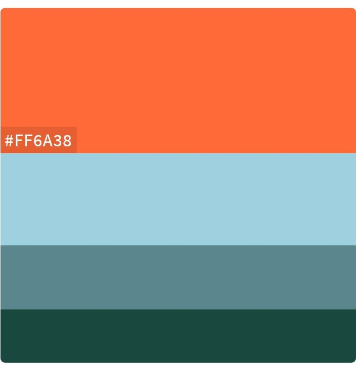
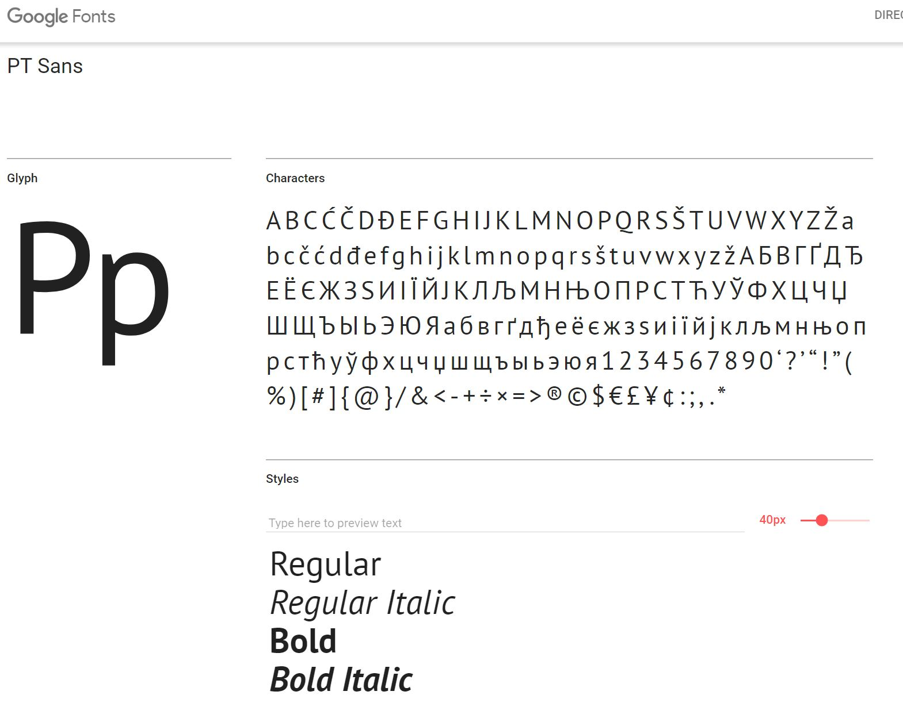
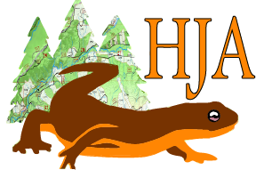
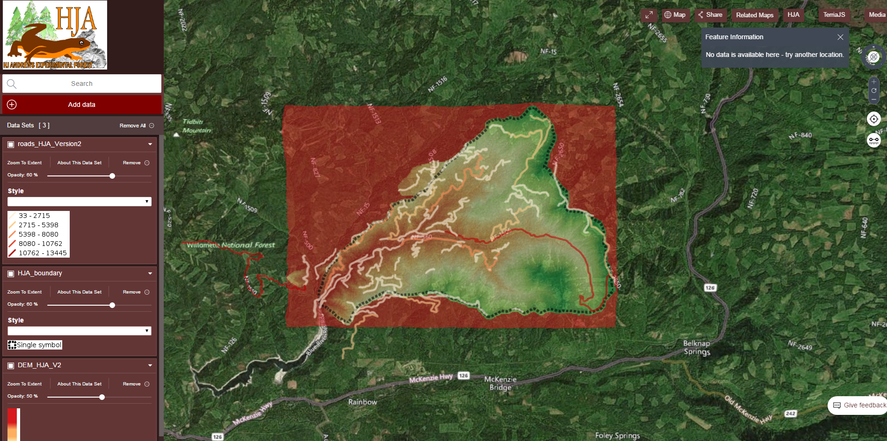

# Forestry Project: Design Scheme

1. Color Palette :

   ​	Given that this project is focused on forestry, the group has decided that using different shades of green would be cartographically the most appropriate. Additionally, due to the association to Oregon State, a shade of orange would also be appropriate. 

2. Fonts :

   ​	The intended font for the web design is PT Sans from Google Fonts.

   ​

3. Logo : 

   ​	The logo is an alteration of the existing HJA logo. The color scheme has been changed to sign to signify OSU. The trees have been altered to have a topographic map super-imposed onto the front of it.

   ​

   

4. Multimedia :

   The group will be making a trip to HJA on 25th to do some drone mapping. At that time, the group will also collect some aerial imagery and video to implement into the web design and media tab.

Current design : Image below shows an recent example of the web design template

. 
